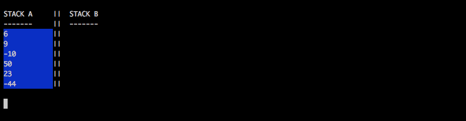

# Push_swap
## 1. Introduction
The Push_swap project is a very simple and highly effective algorithm project: data will
need to be sorted. You have at your disposal a set of int values, 2 stacks (A, B) and a set of
instructions to manipulate both stacks.
This project includes 2 programs:
### 1.1. Push_swap
Calculates and displays on the standard
output the smallest progam using Push_swap instruction language that sorts integer
arguments received.
### 1.2. Checker
Takes integer arguments and reads instructions on
the standard output. Once read, checker executes them and displays OK if integers
are sorted. Otherwise, it will display KO.
## 4. Game rules
Stack A contains a random number of either positive or negative numbers without
any duplicates. Stack B is empty. The goal is to sort in ascending order numbers into stack A.
• To do this you have the following operations at your disposal:

Operation | Description
--------- | -------------
sa : swap a | swap the first 2 elements at the top of stack a. Do nothing if there is only one or no elements).
sb : swap b | swap the first 2 elements at the top of stack b. Do nothing if there is only one or no elements).
ss | sa and sb at the same time.
pa : push a | take the first element at the top of b and put it at the top of a. Do nothing if b is empty.
pb : push b | take the first element at the top of a and put it at the top of b. Do nothing if a is empty.
ra : rotate a | shift up all elements of stack a by 1. The first element becomes the last one.
rb : rotate b | shift up all elements of stack b by 1. The first element becomes the last one.
rr | ra and rb at the same time.
rra : reverse rotate a | shift down all elements of stack a by 1. The flast element becomes the first one.

## 5. Solution
My program uses different algorithms depending on the input size:

* When the number of arguments is less than 7, I use a priority queue with a heuristic.
* When the number of arguments is between 7 and 80 I use a Selection sort algorithm.
* When the number of arguments is higher than 80, I use a Quicksort algorithm.

## 6. Run program
```
make
```
+ **PUSH SWAP**
```
./push_swap 4 5 3 1
```
+ **PUSH SWAP**
```
./checker 4 5 3 1
```
+ **PUSH SWAP | CHECKER**
```
ARG="4 5 3 1"; ./push_swap $A | ./cheker $ARG
```
The -v flag in checker Show the stacks status after each operation


